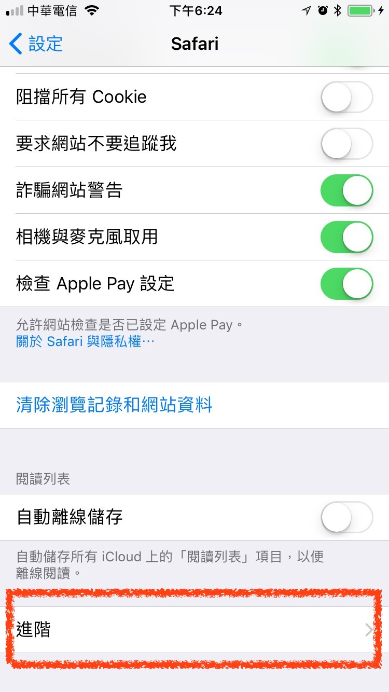
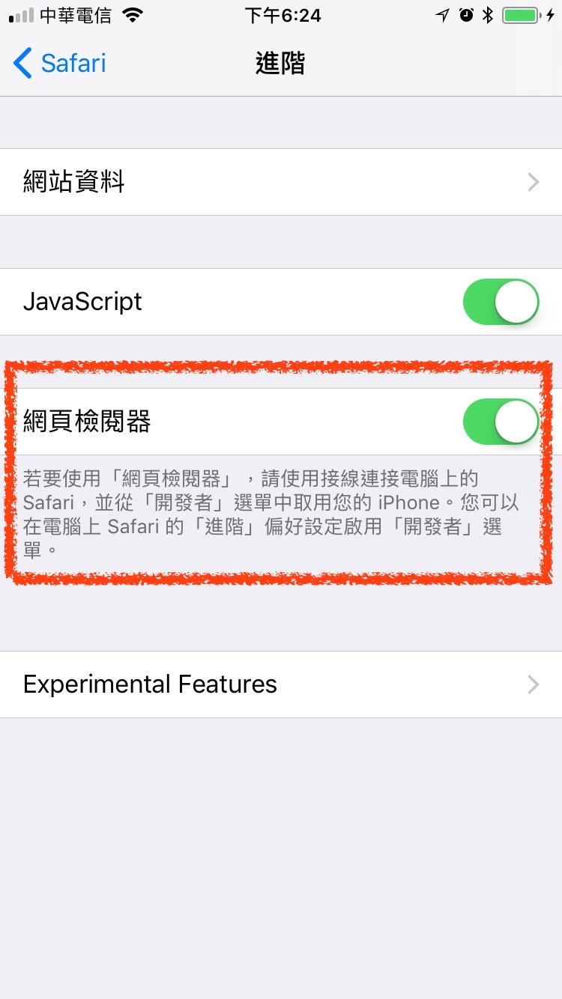
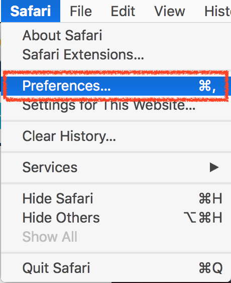
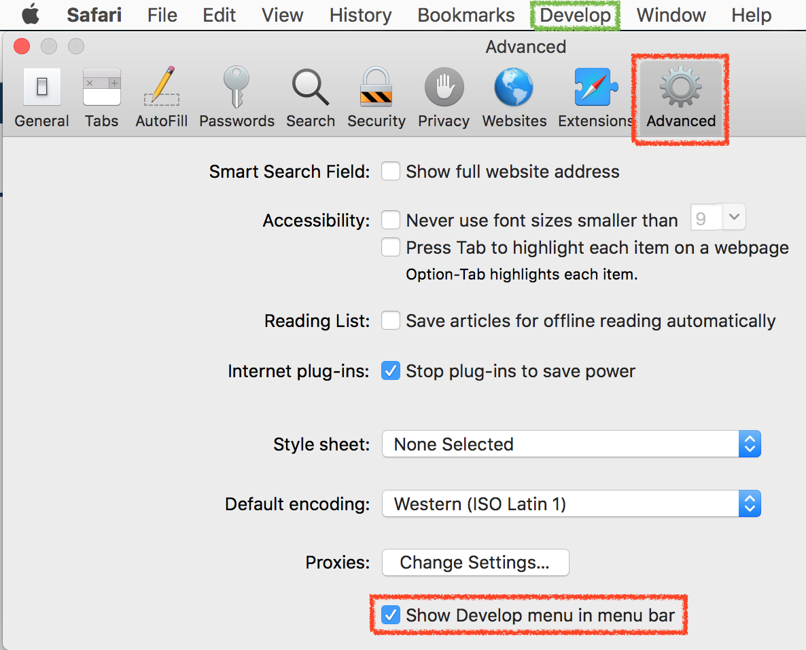
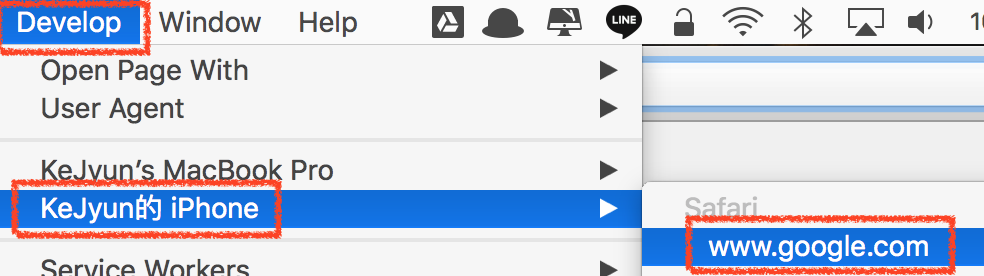
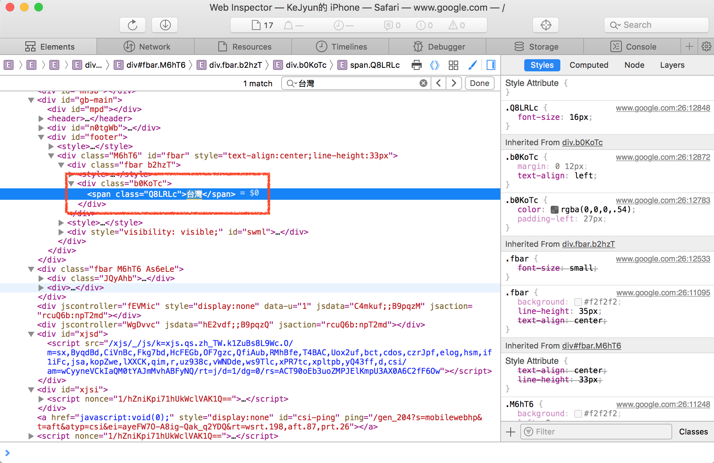
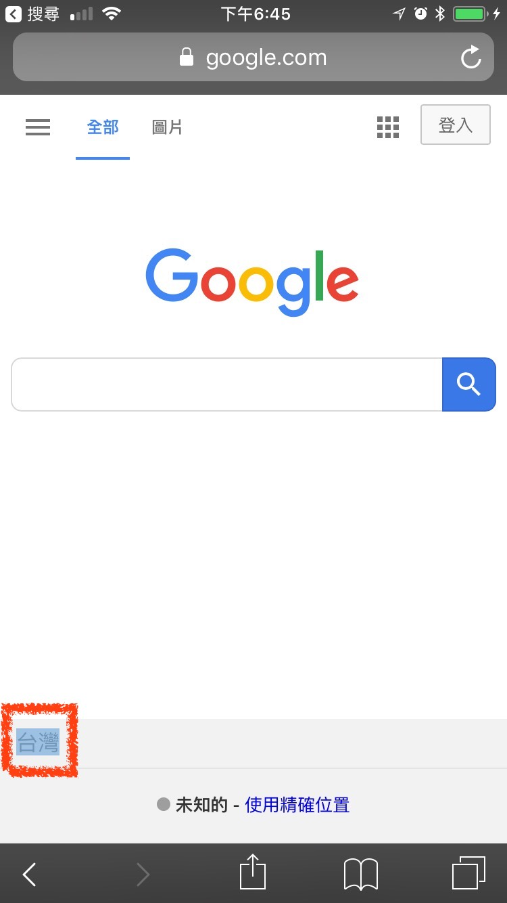
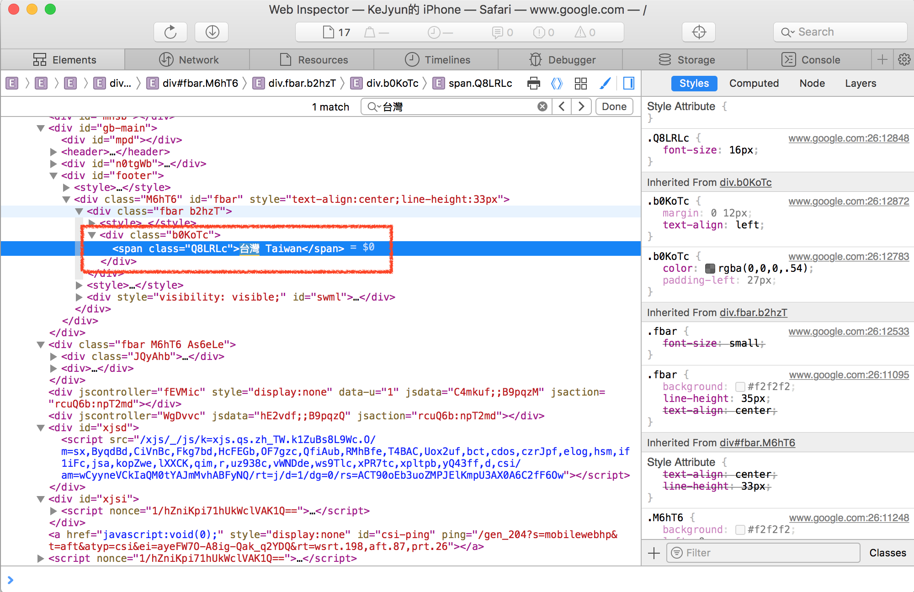
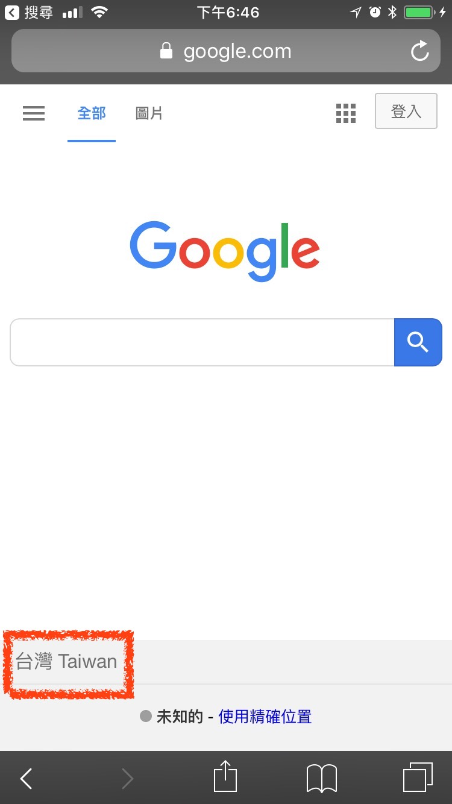

# iPhone Safari 除錯

**1. 設定 iPhone**

`設定(Setting)` > `Safari` > `進階（Advanced）` > `網頁檢視器（Web Inspector）`

**2. 設定 Macbook Safari**

開啟 Macbook Safari，點選 `preferences` 設定

在 `Advanced` 頁籤，勾選 `Show Develop menu in menu bar`，就可以在最上方選單看到 `Develop` 的選項

**3. 使用 Macbook Safari Web Inspector 除錯**

將 iphone 使用 usb 線連至電腦，並開啟 iphone 的 Safari，開啟要除錯的網頁

在 Macbook Safari 的 `Develop` 選單中可以看到自己的手機，點選要除錯的視窗標題

在 Safari Web Inspector中，將指標移動到 Google 首頁的台灣字樣，選取整個元素

可以看到在 iphone Safari 也可以同步看到台灣字樣的元素被選取

使用 Web Inspector，將 `台灣` 修改為 `台灣 Taiwan`

修改完後，可以同步看到 iphone Safari 的文字也被修改了

## 參考資料
* [A Concise Guide to Remote Debugging on iOS, Android, and Windows Phone - Telerik Developer Network](https://developer.telerik.com/featured/a-concise-guide-to-remote-debugging-on-ios-android-and-windows-phone/)
* [利用 Chrome 對 iOS 裝置進行除錯(iPhone、iPad)的絕佳方案＠WFU BLOG](https://www.wfublog.com/2017/12/chrome-ios-remote-debug-webkit-adapter.html)
