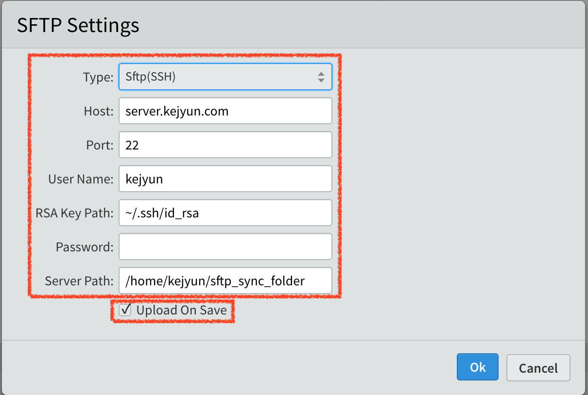

# Brackets

## 使用 SFTP 即時上傳檔案

**1. 安裝 SFtpUpload 套件**

**2. 開啟 SFtpUpload 設定 Pannel**

點選編輯器右方的向上按鈕，可以開啟 SFTP Pannel，點選 `Server Setup` 設定連線主機

**3. 設定 SFtpUpload 連線主機**

勾選 `Upload On Save` 可以在儲存檔案後立即上傳檔案

## 參考資料
* [Brackets - A modern, open source code editor that understands web design.](http://brackets.io/)
* [bigeyex/brackets-sftp-upload: SFTP upload plugin for brackets](https://github.com/bigeyex/brackets-sftp-upload)
