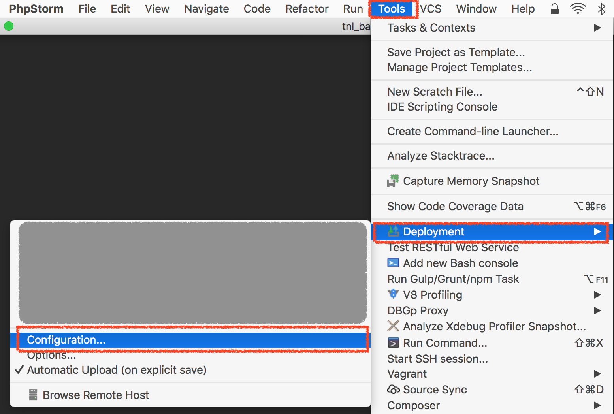
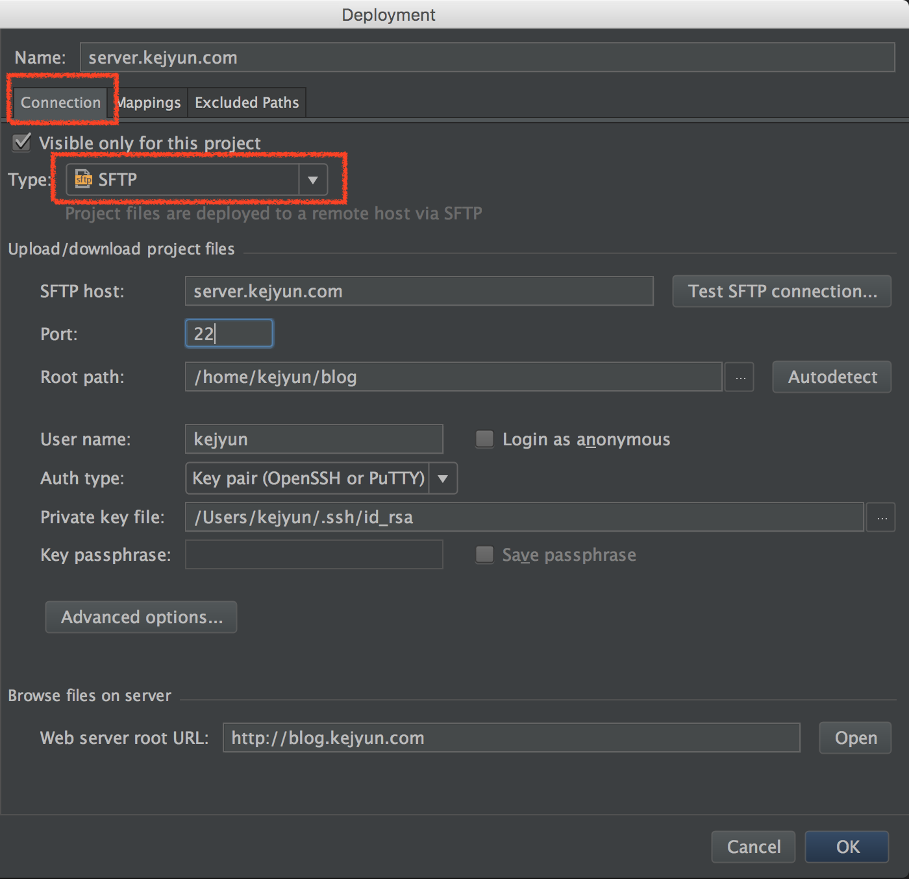
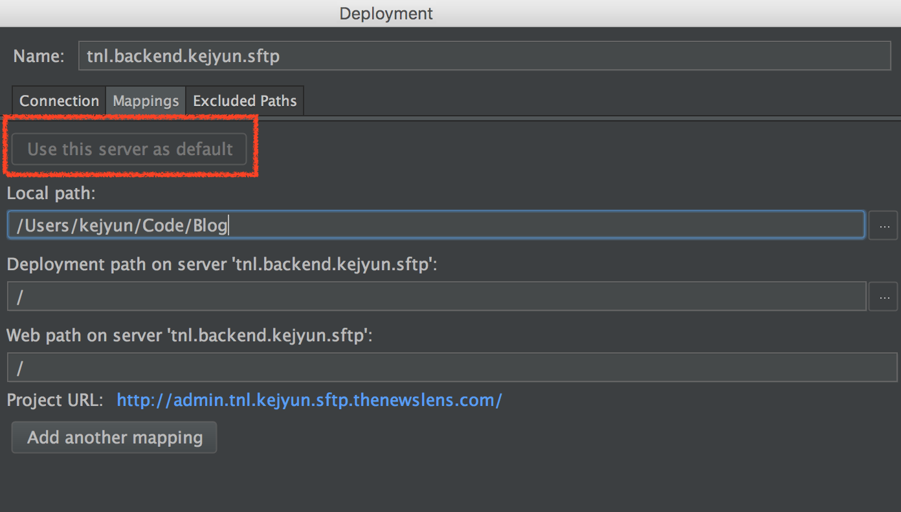
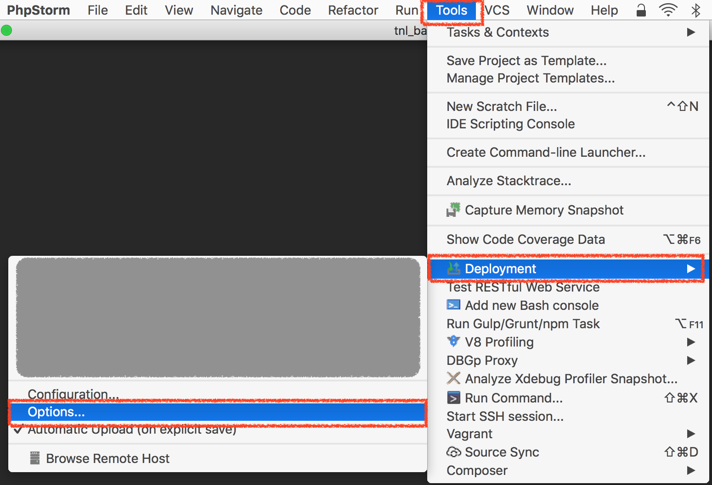
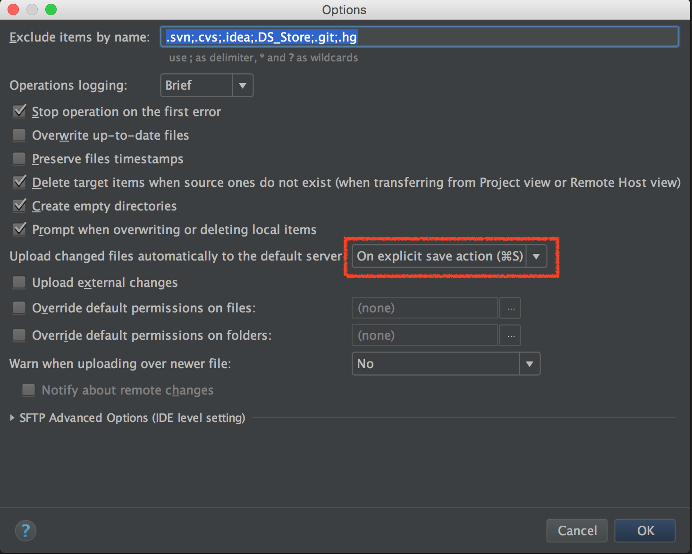

# PHP Storm

## SFTP 檔案自動同步

**1. 部署方式**

> 選單 > `Tools` > `Deployment` > `Configuration`

**2. 設定部署連線方式**

在 `Connection` 的頁籤選擇使用 `SFTP` 去連線

| 選項 | 說明 | 範例 |
|---|---|---|
| SFTP host | 主機網址 | server.kejyun.com |
| Port | 連接阜 | 22 |
| Root path | 根目錄 | /home/kejyun/blog |
| User name | 帳號 | kejyun |
| Auth type | 驗證方式 | Key pair |
| Private key file | 私密金鑰 | /Users/kejyun/.ssh/id_rsa |

**3. 設定部署資料夾對應方式**

| 選項 | 說明 | 範例 |
|---|---|---|
| Local path | 本地端路徑 | /Users/kejyun/Code/Blog |
| Deployment path on server | 部署路徑 | / |

> 關於 `Deployment path on server`，這裡的路徑指的是相對於 `Root path` 的路徑，若 `Root path` 為 `/home/kejyun/blog` 而 `Deployment path on server` 為 `web`，則在本地端專案的 `test.txt` 檔案就會被上傳到遠端的 `/home/kejyun/blog/web`

設定完成後點選 `Use this server as default` 就可以設定此專案使用這個連線設定

**4. 部署選項**

> 選單 > `Tools` > `Deployment` > `Options`

**5. 設定部署選項**

選擇 `On explicit save action` 設定儲存檔案時自動上傳

設定完成後，就可以在專案中，儲存檔案時自動將檔案上傳到遠端伺服器了！

## 參考資料
* [Sync changes and automatic upload to a deployment server in PhpStorm - PhpStorm - Confluence](https://confluence.jetbrains.com/display/PhpStorm/Sync+changes+and+automatic+upload+to+a+deployment+server+in+PhpStorm)
* [PhpStorm 2016.2 Help :: Options](https://www.jetbrains.com/help/phpstorm/2016.2/options.html)
* [Source Synchronizer - Plugins | JetBrains](https://plugins.jetbrains.com/plugin/7374-source-synchronizer)
